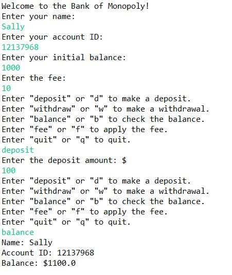

## Bank Account 
Language: Java  
Create a bank account object and a interactive driver program that allow user to create and modify their bank account. 

 

  

#### Part I- BankAccount Class 
Write a class to describe a BankAccount object. 

#### Part II- Driver Program
Write an interactive driver program for the user to create and modify bank account objects. 
Write a menu so the user can repeatedly make a deposit, a withdrawal, check the balance, apply a fee, or quit.

